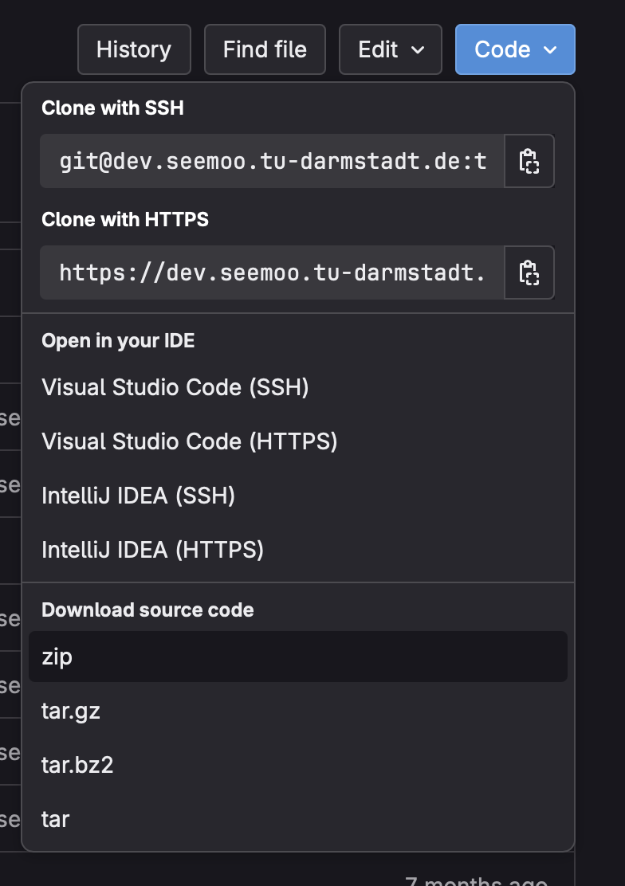
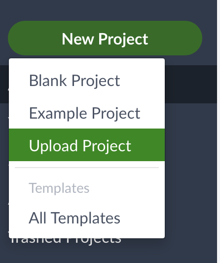

# SEEMOO Thesis Template

This is a LaTeX template to be used for all theses written at SEEMOO.
This README is supposed to get you started quickly, avoid frustration, and
let you spend more time working on your actual project.

*If you have a bug fix or general improvement, don't keep them to yourself but create a pull request!*

## Structure of the Template

The main files of the template:
* [Thesis.tex](Thesis.tex) -- the main LaTeX file providing the outer structure of the thesis
* [classicthesis.sty](classicthesis.sty) -- the [classicthesis](https://ctan.org/pkg/classicthesis) style file, on which this template builds (don't change)
* [classicthesis-seemoo.sty](classicthesis-seemoo.sty) -- the SEEMOO adjustments of the `classicthesis` style and home of some useful macros
* [classicthesis-config.tex](classicthesis-config.tex) -- the main configuration file

The LaTeX source files are contained within numbered folders:
* [00-definitions/](00-definitions/) -- contains definitions like personal information, acronyms, special hyphenation
* [01-bibliography/](01-bibliography/) -- contains all BibTeX references
* [02-front-matter/](02-front-matter/) -- contains abstract, acks, dedication, etc.
* [03-chapters/](03-chapters/) -- contains the thesis's main chapters
* [04-back-matter/](04-back-matter/) -- contains additional appendix chapters (e.g. questionnaires, long proofs), thesis statement, AI declaration, etc.

These folders provide auxiliary material:
* [build/](build/) -- provides Makefiles etc. for building the thesis
* [graphics/](graphics/) -- for figures and graphics

Check out these helpers:
* [.githooks/](.githooks/) -- git hooks to use gitinfo2 in draft mode
* [editor-configs/](editor-configs/) -- contains editor configurations for typical IDEs (feel free to add yours!)

## Available Styles

You can choose between different styles for your thesis inside the main configuration file [classicthesis-config.tex](classicthesis-config.tex). In general look for comments of the form `% -- TemplateKnob`. These indicate important places for changing the template in major ways, like for example:

* **Drafting mode.** To enable a drafting mode (prints date, version number, and git commit hash in footer),
set the `drafting` option in [classicthesis-config.tex](classicthesis-config.tex) to `true`. To display the git commit hash, you have to install and trigger the [gitinfo2](https://ctan.org/pkg/gitinfo2) hooks once via
```bash
make setup-git-hooks
```
* **Layout.** The `layout` option controls the space for text and floats. The following are available: `standard`, `balanced`, `tight` and `dense`. These layouts mainly trade horizontal space for text and floats with space for margins. If you are uncertain, try `standard` (default `classicthesis` layout) or `balanced` (more horizontal space for figures and tables). Also have a look inside the [classicthesis-config.tex](classicthesis-config.tex) for more details.
* **Use parts.** The `parts` option will add another layer of structure
  to your thesis. Only use this if your thesis is particulary long or
  additional structure makes sense.
* **PhD thesis.** The `phd` option adds additional front and back matter
  pages to the template that are relevant if you write a PhD thesis and also enables the parts option.

## Get Started

1. Skim over [Thesis.tex](Thesis.tex). Note which files are included in which position.
2. Check out [classicthesis-config.tex](classicthesis-config.tex) and configure the template to your needs.
3. Enter your personal information in [00-definitions/PersonalInfo.tex](00-definitions/PersonalInfo.tex).
3. Build the first version of your thesis.
4. Write your thesis successfully! :-).

## GitLab CI/CD

This repo contains a [.gitlab-ci.yml](.gitlab-ci.yml) file to automate building PDFs as well as check if they are PDF/a compliant.
To use it you have to enable CI/CD features via `Settings --> General --> Visibility, project features, permissions`.

You can also add badges via `Settings --> General --> Badges with for example the following settings` to show the pipeline status:
```
Name: Pipeline status
Link: https://dev.seemoo.tu-darmstadt.de/%{project_path}/-/tree/%{default_branch}
Badge image URL: https://dev.seemoo.tu-darmstadt.de/%{project_path}/badges/%{default_branch}/pipeline.svg
```
or to provide a way to download the most recently built PDF:
```
Name: Download latest PDF
https://dev.seemoo.tu-darmstadt.de/%{project_path}/-/jobs/artifacts/%{default_branch}/file/Thesis.pdf?job=build
https://img.shields.io/badge/download-PDF-informational
```

## Building

Latexmk build settings and compilation rules can be found in the `.latexmkrc` file.

```sh
make                       # Option A: local TeX installation
build/dockmake.sh document # Option B: TeX in Docker
latexmk Thesis             # Option C: local TeX installation without Makefile
```
Note that Option B requires [Docker](https://www.docker.com).

After compilation, you can check out the compiled thesis in the main folder.

### Windows
If you are using Windows, you **must** build once for the bibliography to compile correctly.
Make sure to install [Perl](https://www.perl.org) to ensure the commands can execute properly.

### Cleaning

Cleaning will remove auxiliary files created during building your thesis, as well as the resulting PDF.
While compiling is generally faster if you do not clean between compiles, cleaning often works wonders if you're stuck with a LaTeX error you do not understand.

```sh
make clean                  # Option A: local TeX installation
build/dockmake.sh clean     # Option B: TeX in Docker
latexmk Thesis -c           # Option C: local TeX installation without Makefile
```

### Overleaf / TU ShareLaTeX

The recommendations for Overleaf are the same as for the TU ShareLaTeX. We just use the term "Overleaf" here.

#### Uploading
1. Go to our thesis [git repository](https://dev.seemoo.tu-darmstadt.de/templates/seemoo-thesis-template).
2. Click the `Code` button on the top right.
3. Select `zip` (see image below).
4. Open your Overleaf / TU ShareLaTeX.
5. Click the `New Project` button on the top left.
6. Select `Upload Project`.
7. Upload the ZIP downloaded from our Git repository.

GitLab zip Download:


Creating a new project:


#### Acronyms (or something else) do not work in Overleaf
In that case, you did something wrong when uploading. For some reason, Overleaf does not like it when your root Tex file is **not** in the root folder. When uploading, make sure that you do not zip a folder which contains your project, but all files.
For example, selecting the folder that you want to upload on macOS, right clicking and then uploading it will fail.
